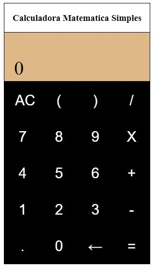

<h1 align="center">
	Calculadora React
</h1>

# About the project
O projeto consiste na criação de uma tela simples de login fazendo manipulação de componentes via React.

# Technologies
- ReactJs in function
- Hooks
- Componentes

<h1 align="center">
	
</h1>


#


Requirements
- npm
- yarn


*Clone the project and access the folder*

```bash
git clone https://github.com/cbmateus-dev/calculadoraTreinoReactJS.git
```

&&
```
bash
cd calculadorareact
```


*Follow the steps below*

bash
# Install the dependencies
$ npm install or yarn install

# To finish, run the application
$ npm start or yarn start

# Well done, project is started!
```
